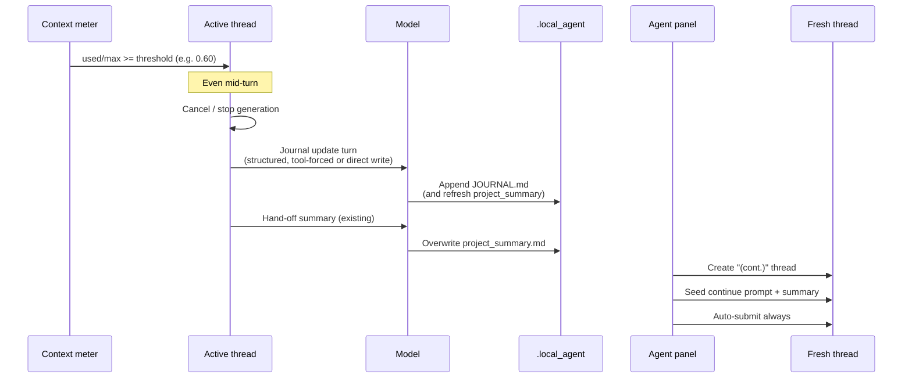

# Enhanced Auto Thread Rollover

**Status:** Plan only — implement if settings tuning is not enough  
**Created:** 2026-07-25  
**Related:** `agent.auto_thread_rollover`, `.local_agent/JOURNAL.md`, `.local_agent/project_summary.md`

## Goal

When context fills past a configured level, LEAD should:

1. **Stop** the current agent turn (including mid-turn)
2. Have the model **update durable journal memory** before the thread dies
3. **Open a fresh thread** with a continue prompt
4. **Always auto-continue** (not only when a `/goal` is active)

The intent is to reduce local-model drift (repetition, lost constraints, “weird” behavior) after several compaction/rollover hops.

## Try first (no code)

Before implementing this plan, tune existing knobs and re-test long sessions:

```json
{
  "agent": {
    "auto_thread_rollover": {
      "enabled": true,
      "context_fraction": 0.60
    }
  }
}
```

Also useful:

- Try `0.55` if `0.60` still feels late for your model
- Prefer `/goal` for long autonomous work (today only goals auto-resume after rollover)
- Keep journal tools enabled so the agent can append progress notes during work
- Confirm the context usage ring updates for your LM Studio / network-agent model (so fullness is real, not missing)

If that is “good enough,” leave this plan unimplemented.

---

## Current behavior (baseline)

| Piece | Today |
|-------|--------|
| Trigger | After turn completes (`maybe_auto_rollover`), when idle |
| Threshold | `agent.auto_thread_rollover.context_fraction` (default `0.75`) |
| Fullness | `Thread::context_fullness()` ← `latest_token_usage()` |
| Mid-turn stop | No — waits for idle |
| Hand-off | `generate_handoff_summary()` (separate completion) |
| Disk write | Overwrites `.local_agent/project_summary.md` |
| Journal | Not updated by rollover; append-only via `append_to_journal` tool |
| New thread | Seeded with hand-off text |
| Auto-continue | **Only if an active `/goal` is present** |
| In-thread compaction | Separate path; also overwrites `project_summary.md` |

Key call sites:

- `crates/agent_ui/src/conversation_view/thread_view.rs` — `maybe_auto_rollover`
- `crates/agent_ui/src/agent_panel.rs` — `roll_over_thread`
- `crates/agent/src/thread.rs` — `should_roll_over`, `context_fullness`, `generate_handoff_summary`, compaction
- `crates/agent/src/project_memory.rs` — journal / summary I/O
- `crates/agent_settings` + `crates/settings_content` — settings schema
- `assets/settings/default.json` — defaults / comments

---

## Proposed behavior

### High-level sequence



### 1. Mid-turn stop

When fullness crosses the threshold **during** a turn (on `TokenUsageUpdated` / usage events), not only when idle:

- Cancel the running turn (same cancellation path as user Stop / `interrupt`)
- Mark the thread as “rollover in progress” so it cannot re-trigger
- Do **not** leave a half-finished tool call hanging without a clear terminal state (reuse existing cancel + tool abort behavior)

**Guardrails (keep existing ones):**

- Root thread only (no subagents)
- Not already `rolled_over`
- At least N user messages (today: ≥ 2) to avoid ping-pong on tiny threads
- Optional: require fullness to stay above threshold for one usage sample after cancel, to avoid flapping from estimates

### 2. Journal update before hand-off

After stop, run a **short, dedicated rollover prep turn** (or a non-chat completion) whose only job is durable memory:

**Preferred (deterministic):**  
LEAD synthesizes a journal entry from the hand-off summary and calls `append_journal` in Rust — no extra model turn, no tool-permission friction.

**Alternative (agentic):**  
Send a fixed user/system prompt: “Append a concise progress entry to the project journal using `append_to_journal`. Cover objective, done, current state, next steps, pitfalls. Do nothing else.”  
Wait for that tool call (with timeout), then proceed.

**Recommendation for v1:** deterministic append from the hand-off text (plus a short structured template), and still overwrite `project_summary.md` as today. Agentic journal can be a follow-up if entries feel too generic.

Either way:

- Journal **appends** (history preserved)
- `project_summary.md` **overwrites** (latest snapshot for system prompt)
- Cap injected journal size later if system prompts get huge (out of scope for v1, note as follow-up)

### 3. Always auto-continue

Change `roll_over_thread` so non-goal rollovers also `send()` after seeding, with a continue trailer such as:

> Resume from where the previous thread left off using the hand-off and project memory. Do not re-ask for the original task unless it is unclear. Verify current files before editing.

Goals keep their existing stronger resume language.

### 4. Settings (proposed)

Extend `agent.auto_thread_rollover` (names flexible):

```json
{
  "agent": {
    "auto_thread_rollover": {
      "enabled": true,
      "context_fraction": 0.60,
      "interrupt_mid_turn": true,
      "update_journal": true,
      "auto_continue": true
    }
  }
}
```

| Key | Default (proposed) | Meaning |
|-----|--------------------|---------|
| `enabled` | `true` | Existing |
| `context_fraction` | `0.60` (or keep `0.75` and document lower for local) | Existing |
| `interrupt_mid_turn` | `true` | Stop as soon as threshold crossed |
| `update_journal` | `true` | Append journal on rollover |
| `auto_continue` | `true` | Always auto-submit new thread |

Keep defaults conservative if we want zero behavior change for existing users: new flags default `false`, and flip LEAD defaults to the stronger behavior once validated.

---

## Interaction with compaction

Do **not** remove in-thread compaction in v1.

Suggested policy when implementing:

1. Prefer **rollover** once fullness ≥ `context_fraction` (especially with mid-turn interrupt)
2. Keep compaction as a softer relief **below** the rollover threshold, or disable compaction for local models when rollover is enabled — decide after A/B on long sessions

Compaction + multi-rollover “telephone game” is a known quality risk; mid-turn earlier rollover + better journal should reduce how often compaction runs on already-degraded threads.

---

## Implementation sketch (when ready)

### Phase A — Always auto-continue (smallest win)

1. In `AgentPanel::roll_over_thread`, auto-`send()` for all rollovers (not only `goal_active`)
2. Adjust continue prompt copy for non-goal case
3. Tests: panel/thread rollover tests asserting auto-submit

### Phase B — Journal on rollover

1. After hand-off summary succeeds, format a journal entry and `append_journal` for each worktree root
2. Optionally trim / structure the entry (Objective / Done / Next / Pitfalls)
3. Tests in `project_memory` + one integration assertion that journal grew after rollover

### Phase C — Mid-turn interrupt

1. Subscribe to `TokenUsageUpdated` (or check fullness inside usage update handling) in thread view / panel
2. If `interrupt_mid_turn` and `should_roll_over`, cancel then call `roll_over_thread`
3. Ensure cancel completes before hand-off (mirror `stop_current_and_send_new_message` await pattern)
4. Tests: fake model streams usage past threshold mid-turn → cancel + rollover

### Phase D — Settings + docs

1. Extend `AutoThreadRolloverContent` / `AutoThreadRollover`
2. Update `assets/settings/default.json` comments
3. Short user doc under `docs/src/ai/` (optional)

### Suggested file touch list

- `crates/settings_content/src/agent.rs`
- `crates/agent_settings/src/agent_settings.rs`
- `assets/settings/default.json`
- `crates/agent_ui/src/agent_panel.rs` (`roll_over_thread`)
- `crates/agent_ui/src/conversation_view/thread_view.rs` (`maybe_auto_rollover` + mid-turn hook)
- `crates/agent/src/thread.rs` (guards / helpers as needed)
- `crates/agent/src/project_memory.rs` (journal entry helper)
- Agent UI / agent tests

---

## Risks and open questions

1. **Mid-turn cancel during tool execution** — must leave tools in a safe terminal state; may need to wait for in-flight tools or abort them explicitly.
2. **Estimate vs real usage** — with the recent usage ring fix, prefer real LM Studio usage; estimates can fire early/late. Consider requiring reported usage when available.
3. **Double cost** — hand-off already costs a completion; adding an agentic journal turn doubles that. Prefer deterministic journal append in v1.
4. **Journal bloat** — full journal is injected into every new thread’s system prompt; long projects may need a “last N entries” or size cap later.
5. **User surprise** — always-auto-continue changes control; gate with `auto_continue` setting and a short UI toast (“Rolling over to keep context healthy…”).
6. **Failed hand-off** — today rollover aborts if summary fails; decide whether to still journal a minimal “context full, interrupted” note.

---

## Acceptance criteria (when implemented)

- [ ] Crossing `context_fraction` mid-turn stops generation (when `interrupt_mid_turn` is on)
- [ ] Rollover appends a journal entry when `update_journal` is on
- [ ] `project_summary.md` still refreshed with the latest hand-off
- [ ] New thread is created, focused, seeded, and auto-submitted when `auto_continue` is on (with or without `/goal`)
- [ ] Subagents and already-rolled threads still never re-rollover
- [ ] Existing guards against tiny-thread ping-pong remain
- [ ] Focused unit/integration tests cover A/B/C above

---

## Decision log

| Date | Decision |
|------|----------|
| 2026-07-25 | Plan written; user will try `context_fraction` / goal / journal-tool tuning first |
| 2026-07-25 | Prefer deterministic journal append over a second agent turn for v1 |
| 2026-07-25 | Implement only if tuning is insufficient |
| 2026-07-27 | Phase A (always auto-continue after rollover) implemented in `roll_over_thread` |

When ready to build mid-turn/journal pieces: open Agent mode and point at this file (`docs/plans/enhanced-thread-rollover.md`).
