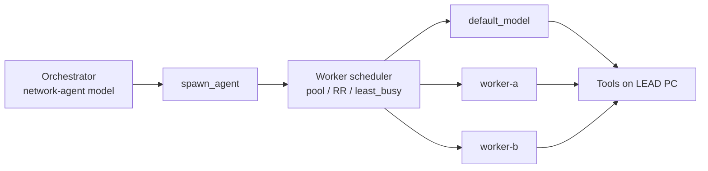

# Hybrid Worker Pool (Multi-Worker Hybrid)

**Status:** Implemented (settings.json configuration; no settings UI yet)  
**Created:** 2026-07-27  
**Related:** `agent.network_agent`, `spawn_agent`, OpenAI-compatible providers

## Goal

Extend Hybrid mode so one **orchestrator** can use a **pool of up to 10 networked workers** (LM Studio, Ollama, or any OpenAI-compatible endpoint). Workers share inference load; tools still run on the LEAD machine.

Two scheduling modes (both configured here):

| Mode | Id | Behavior |
|------|-----|----------|
| **1 — Parallel pool** | `pool` | Each `spawn_agent` picks a free / least-busy worker. Independent subagents run on different boxes in parallel. |
| **2 — Round-robin / least-busy** | `round_robin` or `least_busy` | Completions (and/or spawns) are balanced across workers for throughput and failover. |

Recommended default when implementing: `least_busy` (covers parallel pool well; falls back cleanly when only one spawn is active).

## Try / fill in now

Example settings live at:

[`hybrid-worker-pool.example.settings.json`](./hybrid-worker-pool.example.settings.json)

Copy the `agent.network_agent` + `language_models.openai_compatible` worker blocks into your user `settings.json`, replace the host URLs/models, and keep the schema as documentation until runtime lands.

**Today:** only the existing single-worker Hybrid fields are honored (`enabled`, `model`, `delegation_mode` + one `network-agent` provider + `default_model` as the worker). Extra keys below are the **target config** for implementation.

---

## Proposed settings shape

```json
{
  "agent": {
    "network_agent": {
      "enabled": true,
      "model": "orchestrator-model-id",
      "delegation_mode": "balanced",
      "workers": {
        "scheduling": "least_busy",
        "max_workers": 10,
        "include_default_model": true,
        "endpoints": [
          {
            "id": "worker-a",
            "provider": "worker-a",
            "model": "qwen3-coder",
            "max_concurrent": 1,
            "enabled": true
          }
        ]
      }
    }
  },
  "language_models": {
    "openai_compatible": {
      "network-agent": { "...": "orchestrator endpoint (existing)" },
      "worker-a": { "api_url": "http://192.168.1.21:1234/v1", "available_models": ["..."] }
    }
  }
}
```

### Field reference

#### Existing (unchanged)

| Key | Meaning |
|-----|---------|
| `network_agent.enabled` | Hybrid on/off |
| `network_agent.model` | Orchestrator model id (from `network-agent` provider) |
| `network_agent.delegation_mode` | `balanced` \| `manual` |

#### New: `network_agent.workers`

| Key | Type | Default | Meaning |
|-----|------|---------|---------|
| `scheduling` | string | `least_busy` | `pool` \| `round_robin` \| `least_busy` |
| `max_workers` | number | `10` | Cap on enabled endpoints (clamp 1–10) |
| `include_default_model` | bool | `true` | Also use `agent.default_model` as a worker in the pool |
| `endpoints` | array | `[]` | Extra worker endpoints (max 10 total with default) |

#### Each `endpoints[]` entry

| Key | Type | Meaning |
|-----|------|---------|
| `id` | string | Stable id for UI / logs / sticky sessions |
| `provider` | string | Key under `language_models.openai_compatible` (or another registered provider id) |
| `model` | string | Model id on that provider |
| `max_concurrent` | number | Max simultaneous subagent turns on this box (default `1`) |
| `enabled` | bool | Soft disable without deleting config |

### Scheduling semantics

**`pool` (strategy 1)**  
- Used when assigning models to new `spawn_agent` sessions.  
- Prefer a worker with `active_spawns < max_concurrent`.  
- If all busy, queue or wait for the next free slot (implementation choice: queue vs reject with clear error).  
- Parallel independent spawns → different workers when capacity allows.

**`round_robin` (strategy 2a)**  
- Walk the enabled worker list in order for each new assignment.  
- Simple, predictable; ignores live load except `max_concurrent` hard caps.

**`least_busy` (strategy 2b, recommended)**  
- Pick the enabled worker with the lowest `active_spawns / max_concurrent`.  
- Ties broken by round-robin among equals.  
- Gives pool parallelism + load balance + natural failover when a worker is at capacity.

**Failover (all modes):** if a completion fails with connection/5xx, mark worker unhealthy briefly, retry once on another worker (new sessions only; sticky `session_id` follow-ups stay on the same worker when possible).

---

## Runtime sketch (when implementing)



1. Register each worker provider like today’s `openai_compatible` map (already supports multiple keys).
2. Build a `WorkerPool` from `workers.endpoints` + optional `default_model`.
3. On `spawn_agent` (new session): `pool.acquire(scheduling)` → set subagent thread model to that worker.
4. On follow-up with `session_id`: reuse the same worker (sticky).
5. Track in-flight counts per worker id for `least_busy` / capacity.
6. Update Hybrid system prompt to mention “worker pool” instead of a single local worker.

### Likely touch points

- `crates/settings_content/src/agent.rs` — schema
- `crates/agent_settings/src/agent_settings.rs` — resolve/clamp
- `assets/settings/default.json` — comments + empty defaults
- `crates/agent/src/tools/spawn_agent_tool.rs` + subagent creation path — assign model from pool
- `crates/agent/src/thread.rs` — Hybrid prompt / worker model listing
- Settings UI (Network Agent panel) — list/edit up to 10 workers
- Tests: scheduling unit tests + spawn assigns distinct workers under load

---

## Out of scope for v1

- Shipping tools/execution to remote machines (inference only)
- Heterogeneous roles (coder vs reviewer) — can add `role` later
- More than 10 workers
- Auto-discovery of LAN LM Studio instances

---

## Acceptance criteria (when implemented)

- [ ] Up to 10 worker endpoints configurable; extras ignored or rejected with a clear error
- [ ] `scheduling`: `pool`, `round_robin`, and `least_busy` all selectable
- [ ] Parallel `spawn_agent` calls can land on different workers
- [ ] Sticky `session_id` follow-ups stay on the same worker
- [ ] Unhealthy worker skipped for new assignments
- [ ] Single-worker Hybrid (no `workers` block) behaves exactly as today
- [ ] Example settings file remains valid documentation

---

## Decision log

| Date | Decision |
|------|----------|
| 2026-07-27 | Support both strategy 1 (parallel pool) and 2 (round-robin / least-busy) in one `workers` config |
| 2026-07-27 | Prefer `least_busy` as the default scheduler when implementing |
| 2026-07-27 | Config + plan first; runtime later |

When ready to build: open Agent mode and point at this file.
